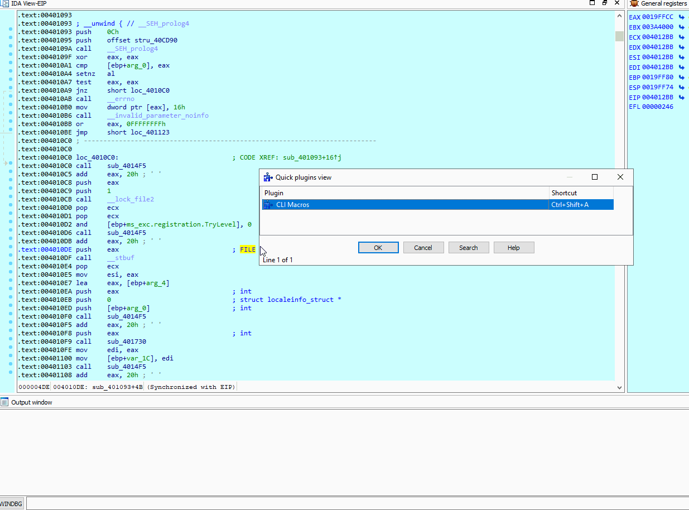
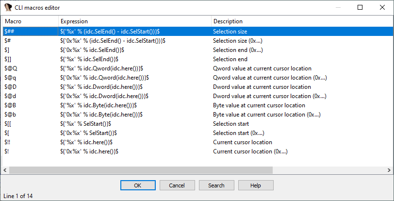
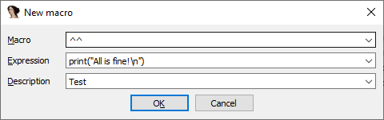
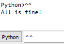
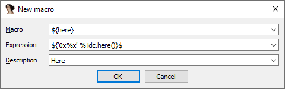
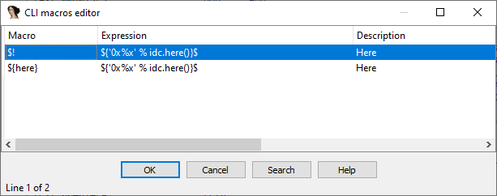
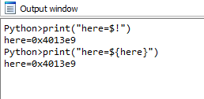

# What is *climacros*?

*climacros* is a productivity tool that lets you define and use static or dynamic macros in IDA's command line interfaces (IDC, Python, WinDbg, BochDbg, gdb, etc.).



## Usage

When installed, *climacros* is always active. It comes with a predetermined set of macros:



### Default macros

These ship on first run. Each expands to a value at the current cursor; the `0x`-prefixed forms are meant to be pasted into a CLI as numbers, while the bare-hex twins (doubled / uppercase) are for use inside strings. Bracket pairs mark scopes: `$<`/`$>` = segment, `$[`/`$]` = selection, `$(`/`$)` = function.

<!-- MACROS:BEGIN (auto-generated from macro_editor.h — do not edit by hand) -->
| Macro | Description |
|-------|-------------|
| `$!` | Current cursor location (0x...) |
| `$!!` | Current cursor location |
| `$<` | Current segment start (0x...) |
| `$>` | Current segment end (0x...) |
| `$<<` | Current segment start |
| `$>>` | Current segment end |
| `$@b` | Byte value at current cursor location (0x...) |
| `$@B` | Byte value at current cursor location |
| `$@w` | Word value at current cursor location (0x...) |
| `$@W` | Word value at current cursor location |
| `$@d` | Dword value at current cursor location (0x...) |
| `$@D` | Dword value at current cursor location |
| `$@q` | Qword value at current cursor location (0x...) |
| `$@Q` | Qword value at current cursor location |
| `$*b` | Debugger byte value at current cursor location (0x...) |
| `$*B` | Debugger byte value at current cursor location |
| `$*d` | Debugger dword value at current cursor location (0x...) |
| `$*D` | Debugger dword value at current cursor location |
| `$*q` | Debugger qword value at current cursor location (0x...) |
| `$*Q` | Debugger qword value at current cursor location |
| `$[` | Selection start (0x...) |
| `$]` | Selection end (0x...) |
| `$[[` | Selection start |
| `$]]` | Selection end |
| `$#` | Selection size (0x...) |
| `$##` | Selection size |
| `$(` | Current function start (0x...) |
| `$)` | Current function end (0x...) |
| `$+` | Next item address (0x...) |
| `$-` | Previous item address (0x...) |
| `$^` | RVA of cursor (offset from image base) (0x...) |
| `$_` | Image base (0x...) |
| `$cls` | Clears the output window |
<!-- MACROS:END -->

To create or edit new macros, simply invoke the macro editor from the "Quick plugins view" window (Ctrl-3).

### How expansion works

Before a CLI line runs, *climacros* rewrites it in **two passes**:

1. **Substitution** — every defined macro name is replaced by its stored *expression*, verbatim.
2. **Evaluation** — any `${ … }$` fragment still present is evaluated as an **IDAPython** expression and replaced by its result.

So a macro is only "dynamic" if its expression contains `${ … }$`; otherwise it is a plain find-and-replace and nothing is evaluated. Evaluated fragments run in IDA's Python (`idc`, `idaapi`, `idautils` are in scope) and **must return a string** — wrap them in `str()` or format with `"%x" % expr`.

### Static macros

A static macro's expression is plain text (no `${ … }$`), so it is substituted **as-is** — handy for boilerplate you retype often. For example, a macro `$sqlcount` whose expression is `SELECT COUNT(*) FROM funcs;` lets you type `$sqlcount` in a CLI to paste that whole query:



Outputs the following when executed:



### Dynamic macros

A dynamic macro's expression contains a `${ … }$` fragment, so pass 2 evaluates it. For example, `idc.here()` (the current cursor) can be abbreviated as `$!` or `${here}`.

To define one, just surround its expression with `${` and `}$`.

The long form macro `${here}` for the `idc.here()` expression is defined like this:



The short form `$!`:



A macro is invoked when it is present in a CLI command:



### Inline substitution

You don't have to define macros in order to get expressions expansion in the CLI. If you need a one-off expression expansion in the CLI, just define the expression inline:

```python
fn = "test_${str(sum(range(10)))}$.bin"
```
Or:
```python
v = "${str(1 + 2 + 3 + 4)}$"
```

The expression should always evaluate to a **string**, therefore always remember to `str()` the expression or to format it `"%x" % expr` if it does not return a string.

## Installation

*climacros* is written in C++ with IDA's SDK and therefore it should be deployed like a regular plugin. 

It requires these components to build:

- [`ida-cmake`](https://github.com/allthingsida/ida-cmake)
- and [`libidacpp`](https://github.com/allthingsida/libidacpp)

The first time you run the plugin, it will be populated with the default macros. If you delete all the macros, you won't get back the default macros unless you delete the following file: `%APPDATA%\Hex-Rays\IDA Pro\firstrun.climacros`.

On Windows, the macros are saved in the registry under: `HKEY_CURRENT_USER\SOFTWARE\Hex-Rays\IDA\CLI_Macros`.

# License

climacros is licensed under the **Human-Origin Source License v1.0** (source-available). See [`LICENSE`](LICENSE) and the per-file `SPDX-License-Identifier: LicenseRef-Human-Origin-Source-1.0` headers. Copyright (c) 2019-2026 Elias Bachaalany.
